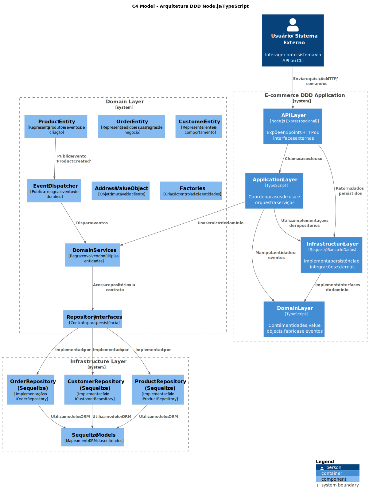
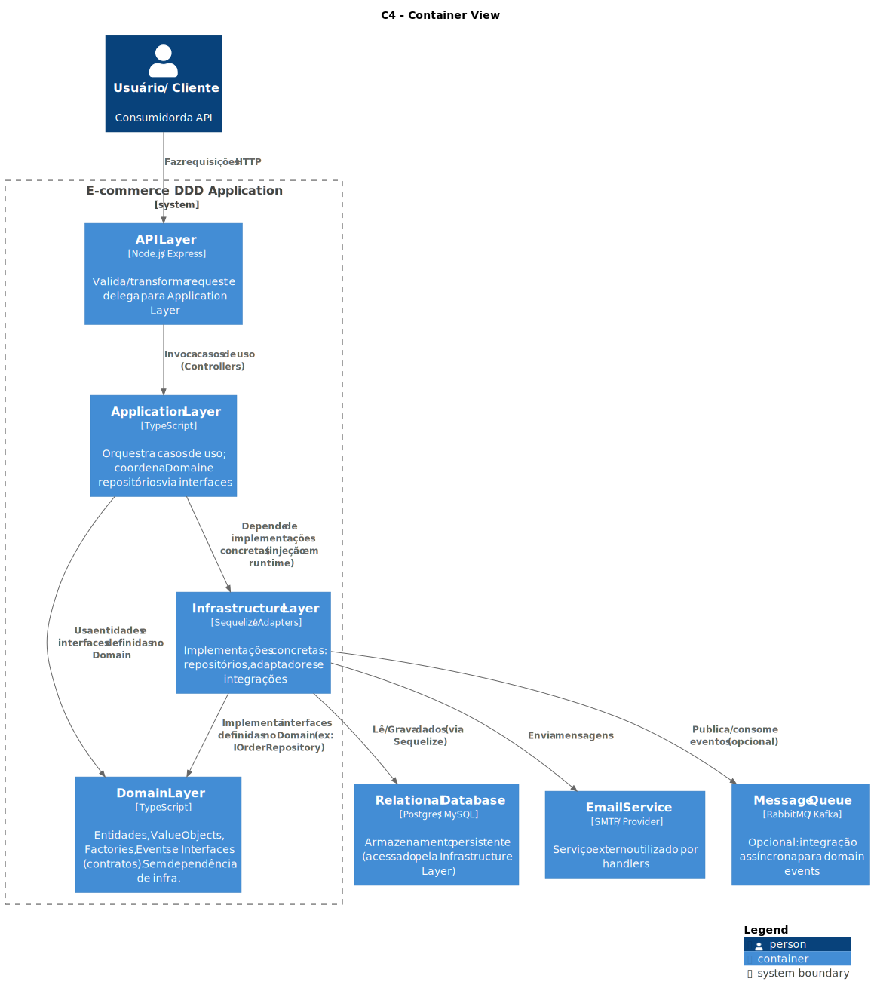
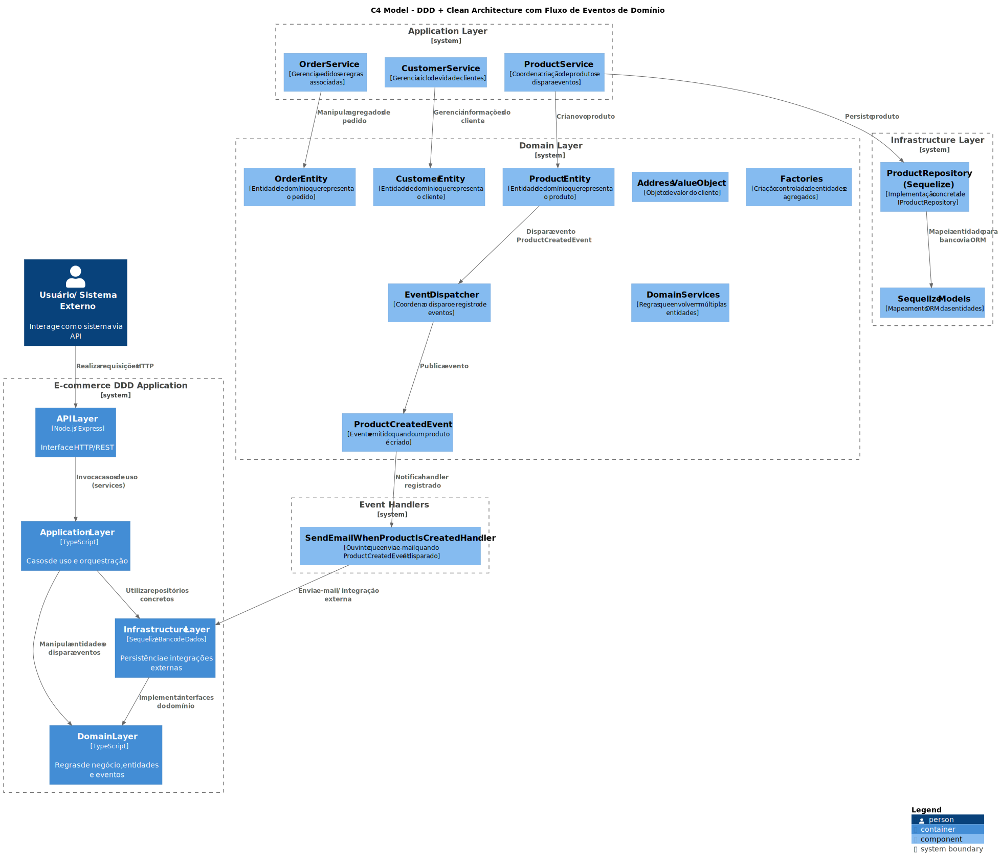
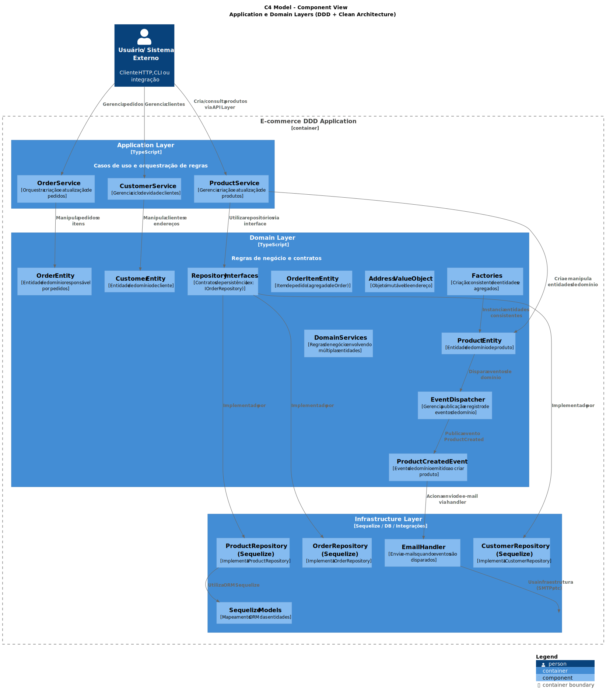

[](https://github.com/danielso2007/fc-ddd-patterns/pulls)
[](https://github.com/danielso2007/fc-ddd-patterns/issues?q=is%3Aopen+is%3Aissue)


[](https://conventionalcommits.org)

**Observação:** A pasta `node_modules` foi incluído, pois no ambiente de estudo do trabalho é bloqueado. Já o `.vscode`, está com as tasks para usar no vscode.

# Projeto de curso DDD: Modelagem Tática e Patterns

Para estudo.

# Estrutura do projeto

Obs.: Para gerar essa saída, foi usado o comando: `tree -I "node_modules|dist|.git"`.

```
.
├── jest.config.ts
├── package.json
├── package-lock.json
├── README.md
├── src
│   ├── domain
│   │   ├── checkout
│   │   │   ├── entity
│   │   │   │   ├── order_item.ts
│   │   │   │   ├── order.spec.ts
│   │   │   │   └── order.ts
│   │   │   ├── factory
│   │   │   │   ├── order.factory.spec.ts
│   │   │   │   └── order.factory.ts
│   │   │   ├── repository
│   │   │   │   └── order-repository.interface.ts
│   │   │   └── service
│   │   │       ├── order.service.spec.ts
│   │   │       └── order.service.ts
│   │   ├── customer
│   │   │   ├── entity
│   │   │   │   ├── customer.spec.ts
│   │   │   │   └── customer.ts
│   │   │   ├── factory
│   │   │   │   ├── customer.factory.spec.ts
│   │   │   │   └── customer.factory.ts
│   │   │   ├── repository
│   │   │   │   └── customer-repository.interface.ts
│   │   │   └── value-object
│   │   │       └── address.ts
│   │   ├── product
│   │   │   ├── entity
│   │   │   │   ├── product-b.ts
│   │   │   │   ├── product.interface.ts
│   │   │   │   ├── product.spec.ts
│   │   │   │   └── product.ts
│   │   │   ├── event
│   │   │   │   ├── handler
│   │   │   │   │   └── send-email-when-product-is-created.handler.ts
│   │   │   │   └── product-created.event.ts
│   │   │   ├── factory
│   │   │   │   ├── product.factory.spec.ts
│   │   │   │   └── product.factory.ts
│   │   │   ├── repository
│   │   │   │   └── product-repository.interface.ts
│   │   │   └── service
│   │   │       ├── product.service.spec.ts
│   │   │       └── product.service.ts
│   │   └── @shared
│   │       ├── event
│   │       │   ├── event-dispatcher.interface.ts
│   │       │   ├── event-dispatcher.spec.ts
│   │       │   ├── event-dispatcher.ts
│   │       │   ├── event-handler.interface.ts
│   │       │   └── event.interface.ts
│   │       └── repository
│   │           └── repository-interface.ts
│   └── infrastructure
│       ├── customer
│       │   └── repository
│       │       └── sequelize
│       │           ├── customer.model.ts
│       │           ├── customer.repository.spec.ts
│       │           └── customer.repository.ts
│       ├── order
│       │   └── repository
│       │       └── sequilize
│       │           ├── order-item.model.ts
│       │           ├── order.model.ts
│       │           ├── order.repository.spec.ts
│       │           └── order.repository.ts
│       └── product
│           └── repository
│               └── sequelize
│                   ├── product.model.ts
│                   ├── product.repository.spec.ts
│                   └── product.repository.ts
├── tsconfig.json
└── tslint.json
```

# Estrutura de Projeto: DDD com Arquitetura em Camadas

Essa estrutura segue o padrão **DDD (Domain-Driven Design)** com arquitetura em camadas, separando **domínio**, **infraestrutura** e **testes**.

A seguir, o detalhamento técnico de cada camada e subpasta:

---

## Raiz do projeto

* **`jest.config.ts`**: Configuração do **Jest** para testes unitários (mapeia paths, transpila TypeScript, define coverage).
* **`tsconfig.json`** / **`tslint.json`**: Configuração do compilador e regras de lint.
* **`package.json`** / **`package-lock.json`**: Dependências, scripts e metadados do projeto Node.js.

---

## `src/domain`

Contém o **core da aplicação**, isolado de infraestrutura. Nenhum código aqui deve depender de frameworks. É a parte **pura da lógica de negócio**.

### `domain/checkout`

* **`entity/`**
    * `order.ts`: **Entidade de domínio `Order`**, com invariantes e regras (ex: total, status).
    * `order_item.ts`: Entidade `OrderItem`, associada à `Order`.
    * `order.spec.ts`: **Teste unitário** das regras da entidade.
* **`factory/`**
    * `order.factory.ts`: Encapsula criação de `Order` e seus itens de forma controlada.
* **`repository/`**
    * `order-repository.interface.ts`: **Contrato de persistência** (não depende de ORM).
* **`service/`**
    * `order.service.ts`: Contém **regras de negócio complexas** que envolvem múltiplas entidades (ex: criar pedido validando estoque).

### `domain/customer`

* **`entity/`**
    * `customer.ts`: **Entidade `Customer`** com regras (ativação, endereço obrigatório, etc.).
    * `customer.spec.ts`: Testes da entidade.
* **`value-object/`**
    * `address.ts`: **Objeto imutável** sem identidade, usado por `Customer`.
* **`factory/`**
    * `customer.factory.ts`: Encapsula criação de `Customer` com `Address`.
* **`repository/`**
    * `customer-repository.interface.ts`: Contrato para persistência de clientes.

### `domain/product`

* **`entity/`**
    * `product.ts` / `product-b.ts`: Diferentes implementações ou versões do produto.
    * `product.interface.ts`: Contrato da entidade.
* **`event/`**
    * `product-created.event.ts`: **Evento de domínio** emitido na criação do produto.
* **`handler/`**
    * `send-email-when-product-is-created.handler.ts`: Ouvinte que reage ao evento.
* **`factory/`**
    * `product.factory.ts`: Encapsula criação de `Product` e variantes.
* **`repository/`**
    * `product-repository.interface.ts`: Contrato de persistência.
* **`service/`**
    * `product.service.ts`: Lógica de negócio envolvendo múltiplos produtos ou agregados.

### `domain/@shared`

* **`event/`**
    * Define o **event dispatcher genérico** (padrão Observer).
    * `event-dispatcher.ts`: Central de registro/disparo de eventos.
    * `event-handler.interface.ts`, `event.interface.ts`: Abstrações.
* **`repository/`**
    * `repository-interface.ts`: Interface base genérica para repositórios.

---

## `src/infrastructure`

Contém **implementações concretas** dos contratos definidos no domínio, usando **frameworks externos** (ORM, DB, etc).

### `infrastructure/customer/repository/sequelize/`

* `customer.model.ts`: Mapeamento ORM (Sequelize) da tabela de clientes.
* `customer.repository.ts`: **Implementação concreta** de `CustomerRepositoryInterface` usando Sequelize.
* `customer.repository.spec.ts`: Testes com banco (mock ou SQLite).

### `infrastructure/order/repository/sequelize/`

* `order.model.ts`, `order-item.model.ts`: Modelos Sequelize.
* `order.repository.ts`: Implementação da interface de repositório do domínio.

### `infrastructure/product/repository/sequelize/`

* `product.model.ts`: Model Sequelize do produto.
* `product.repository.ts`: Implementação concreta do repositório.

---

## Resumo da Arquitetura

| Camada | Função | Depende de |
| :--- | :--- | :--- |
| **Domain** | Regras de negócio puras, entidades, eventos, value objects | Nenhuma |
| **Infrastructure** | Persistência, models ORM, integração com frameworks | Domain |
| **Application** (implícita nos services) | Coordena use cases, orquestra entidades | Domain |
| **Tests** (`.spec.ts`) | Validam comportamento das camadas | Dependem de tudo |

Essa estrutura segue o padrão recomendado em **DDD + Clean Architecture**, isolando o **modelo de domínio** do código de persistência e infraestrutura, o que facilita testes e manutenção.

## Leitura do C4

- Nível 1 – Contexto:
Mostra o sistema (E-commerce DDD Application) e o ator externo (usuário/API client).
- Nível 2 – Containers:
  - Separa as grandes camadas da arquitetura:
  - API Layer — interface HTTP/CLI;
  - Application Layer — coordena casos de uso;
  - Domain Layer — lógica pura e contratos;
  - Infrastructure Layer — persistência e integrações.

- Nível 3 – Componentes (Domain + Infra):
Mostra como o domínio é estruturado em entidades, value objects, factories, serviços e eventos, e como a infraestrutura implementa as interfaces via Sequelize.



## Visão de Containers (C4 Model – Nível 2)

### Leitura do diagrama

| Camada | Responsabilidade | Exemplos de Arquivos |
| :--- | :--- | :--- |
| API Layer | Ponto de entrada do sistema (REST, CLI, etc). Apenas delega chamadas. | (pode estar fora de src/ ou ser adicionado depois) |
| Application Layer | Coordena casos de uso, aplica regras de orquestração e delega persistência. | order.service.ts, product.service.ts, customer.service.ts |
| Domain Layer | Define entidades, value objects, eventos e contratos. Regras puras, sem dependência externa. | product.ts, order.ts, address.ts, product-created.event.ts |
| Infrastructure Layer | Implementa interfaces e integrações. Repositórios concretos, ORM, envio de e-mail, filas, etc. | product.repository.ts, customer.repository.ts, *.model.ts |
		


## Leitura do diagrama (Nível 3 - Fluxo de Eventos)

1. ProductService cria um produto e o persiste via ProductRepository.
2. A entidade Product dispara um ProductCreatedEvent ao ser criada.
3. O EventDispatcher publica esse evento e aciona todos os handlers registrados.
4. O SendEmailWhenProductIsCreatedHandler reage ao evento, executando uma ação — por exemplo, enviar um e-mail de notificação.
5. O handler pode usar recursos da Infrastructure Layer (ex: SMTP, filas, etc.).



## C4 Model Nível 3 (Component View)

#### Interpretação — Component View

- Camada de Aplicação
- Contém Services que representam casos de uso (ex: criar pedido, registrar cliente, adicionar produto).
- Cada Service coordena entidades e repositórios de forma transacional.

#### Camada de Domínio

- Entidades: núcleo da lógica de negócio (Order, Product, Customer).
- Value Objects: tipos imutáveis (Address).
- Factories: garantem criação consistente dos agregados.
- Domain Services: encapsulam regras entre múltiplas entidades.
- Eventos: refletem mudanças significativas (ex: ProductCreatedEvent).
- EventDispatcher: aplica o padrão Observer / Domain Event.

#### Camada de Infraestrutura

- Implementa interfaces de repositórios do domínio com Sequelize.
- Fornece integração com sistemas externos (banco, e-mail, etc).

